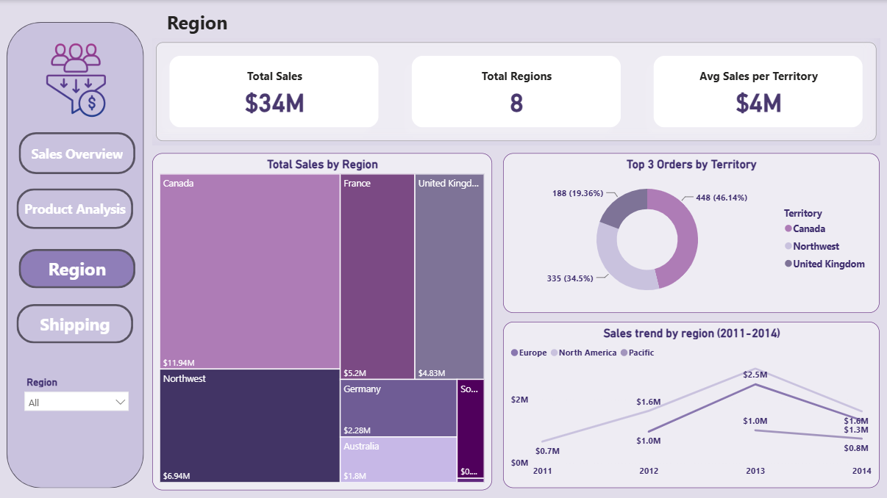
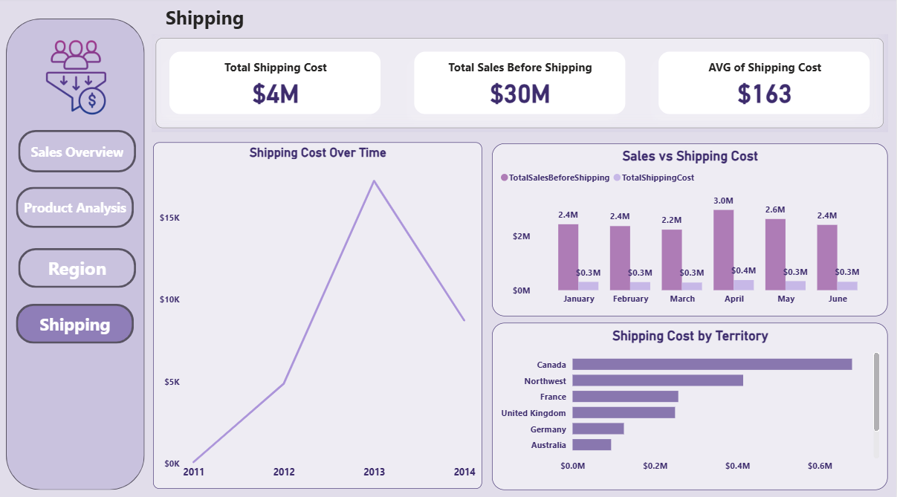

📊 Sales Overview Dashboard | Power BI

📌 Overview

The Sales Overview Dashboard is an interactive Power BI dashboard designed to analyze sales performance and provide a clear view of business performance across products, regions, and shipping.

The dashboard transforms sales data into meaningful insights through interactive visualizations, KPIs, filters, and analytical report pages.

---

🎯 Project Objectives

The main objectives of this project are to:

- Analyze overall sales performance.
- Monitor key sales and business KPIs.
- Analyze product performance and sales contribution.
- Compare sales performance across different regions.
- Analyze shipping costs and shipping performance.
- Identify trends and patterns in sales data.
- Provide an interactive and user-friendly business intelligence dashboard.
- Support data-driven decision-making.

---

🛠️ Tools & Technologies

- Power BI
- Power Query
- Data Cleaning & Transformation
- Data Modeling
- Data Visualization
- Interactive Filters & Slicers
- Business Intelligence

---

📊 Dashboard Pages

The dashboard consists of four main analytical pages:

1. Overview
2. Product
3. Region
4. Shipping

---

🏠 1. Sales Overview

📌 Overview

The Sales Overview page provides a high-level summary of the company's overall sales performance.

It brings the most important business metrics and sales visualizations together in one place, allowing users to quickly understand the overall performance of the business.

🔑 Key Performance Indicators

The dashboard provides an overview of important KPIs, including:

- Total Sales
- Total Shipping Cost
- Total Orders
- Total Customers
- Total Employees

These KPIs provide a quick snapshot of the company's sales activity and operational performance.

📈 Sales Analysis

The page provides an overview of sales performance across different years and product categories.

Users can analyze:

- Sales trends over time.
- Sales contribution by product category.
- Overall business performance.
- Changes in sales performance across different periods.

🎛️ Interactive Filtering

The dashboard includes interactive filters that allow users to explore the data dynamically.

Users can select different years and analyze how the selected period affects the dashboard's KPIs and visualizations.

---

🛍️ 2. Product Analysis

📌 Product Performance

The Product Analysis page focuses on understanding sales performance across different products and product categories.

It allows users to identify which categories contribute the most to overall sales.

📊 Product Insights

The page provides analysis of:

- Sales by product category.
- Product performance comparison.
- Product contribution to total sales.
- Top-performing product categories.
- Product sales trends.

This analysis helps businesses understand customer demand and identify products that have the strongest impact on overall sales.

💡 Business Value

Product analysis can support:

- Product strategy.
- Inventory planning.
- Sales planning.
- Identification of high-performing categories.
- Better understanding of product demand.

---

🌍 3. Regional Analysis

📌 Regional Performance

The Regional Analysis page provides an overview of sales performance across different regions and territories.

It helps identify geographical markets that generate stronger sales and compare performance between territories.

📊 Regional Insights

The page focuses on:

- Sales by region.
- Sales by territory.
- Regional contribution to total sales.
- Comparison between geographical markets.
- Identification of high-performing regions.

💡 Business Value

Regional analysis can help businesses:

- Monitor territory performance.
- Identify strong markets.
- Detect opportunities for market expansion.
- Support regional sales strategies.
- Allocate resources more effectively.

---

🚚 4. Shipping Analysis

📌 Shipping Performance

The Shipping Analysis page focuses on analyzing shipping-related performance and understanding shipping costs.

It provides visibility into how shipping expenses behave alongside overall sales and orders.

📊 Shipping Insights

The page analyzes:

- Total shipping costs.
- Average shipping costs.
- Shipping performance over time.
- Orders and shipping activity.
- Differences in shipping performance.

💡 Business Value

Shipping analysis can help businesses:

- Monitor shipping expenses.
- Identify periods with higher shipping costs.
- Evaluate shipping performance.
- Improve cost management.
- Support operational decision-making.

---

🔍 Key Insights

The dashboard provides a comprehensive view of the company's sales performance and highlights several important areas of the business.

💰 Sales Performance

The dashboard allows users to monitor overall sales performance and identify changes in sales trends over time.

🛍️ Product Performance

Product analysis helps identify the categories and products that contribute most to overall sales.

🌍 Regional Performance

Regional analysis provides visibility into geographical sales performance and helps identify stronger-performing territories.

🚚 Shipping Performance

Shipping analysis provides insights into shipping expenses and helps monitor operational costs.

---

🎛️ Interactive Features

The dashboard provides an interactive experience that allows users to explore the data dynamically.

Users can:

- Filter the dashboard by year.
- Analyze different product categories.
- Explore regional performance.
- Review shipping performance.
- Interact with charts and visualizations.
- Compare different business dimensions.

---

💼 Business Value

This dashboard provides a centralized view of sales performance and helps convert raw sales data into actionable business insights.

It can support stakeholders in:

- Monitoring business performance.
- Identifying high-performing products.
- Evaluating regional performance.
- Monitoring shipping expenses.
- Identifying trends and patterns.
- Supporting data-driven decisions.

---

📂 Dashboard Structure

Page| Main Focus
🏠 Overview| Overall Sales Performance
🛍️ Product| Product & Category Performance
🌍 Region| Regional & Territory Performance
🚚 Shipping| Shipping Performance & Costs

---

🚀 How to Use

1. Download the Power BI ".pbix" file from the repository.
2. Open the file using Power BI Desktop.
3. Navigate through the dashboard pages.
4. Use the available filters and slicers.
5. Interact with the visualizations to explore the sales data.

---
